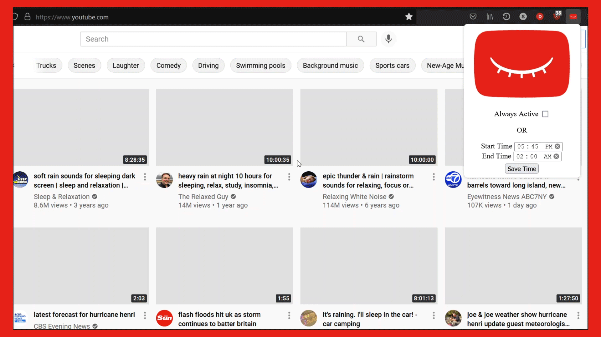
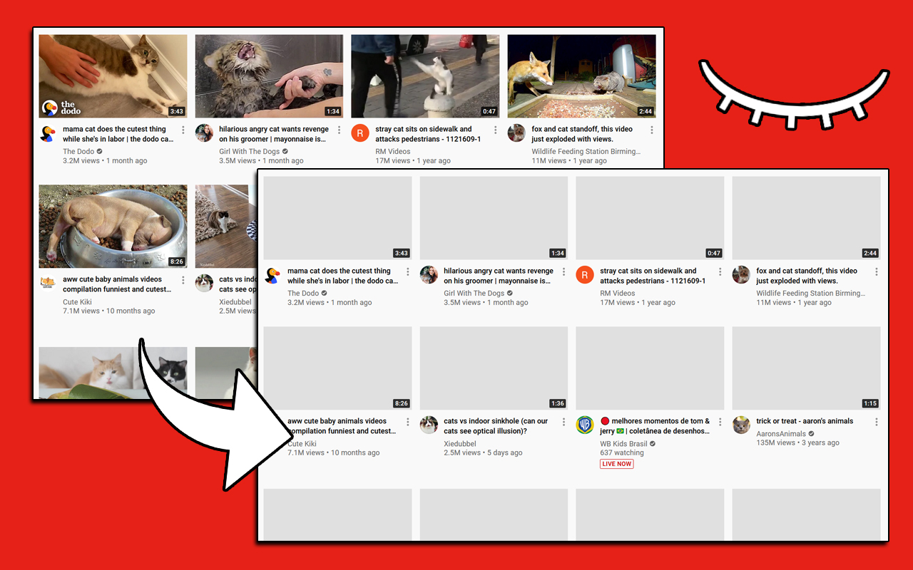

</img>

<h1 align="center">
YouTube Clarity
</h1>

YouTube Clarity is a customizable browser extension aiming to eliminate distraction for those using YouTube as a study aid. This is achieved by removing flashy, distracting thumbnails from YouTube videos and setting their titles to lowercase.

</img>

</img>

## Features
- Hide thumbnails from displaying on YouTube, while still allowing video previews to play when mouse hovers over the video.
- Set video titles to lowercase.
- Only run the extension during certain times of the day (such as during a user's work or study hours).

## Get the Extension
**Firefox:** 
**[Click here](https://addons.mozilla.org/en-US/firefox/addon/youtube-clarity/)**

**Google Chrome:** 
**[Click here](https://chrome.google.com/webstore/detail/youtube-clarity/cpkhmomhgphgnpcckphebmcchlcffjke)** 

*note: the Google Chrome version is a work in progress*